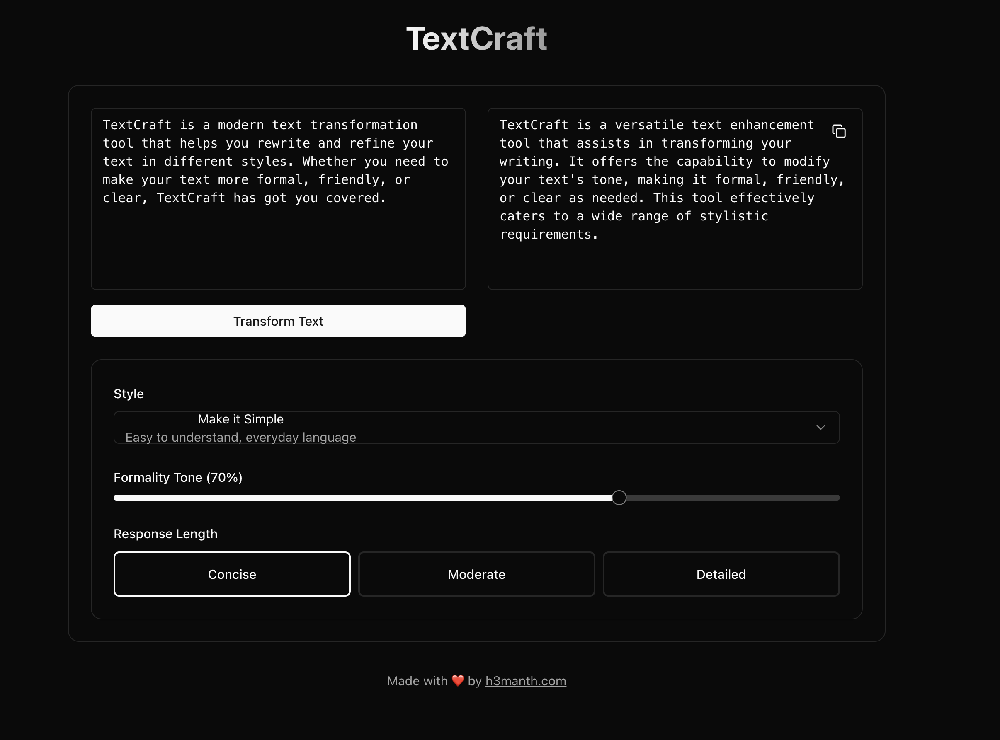

# TextCraft

TextCraft is a modern text transformation tool that helps you rewrite and refine your text in different styles. Whether you need to make your text more formal, friendly, or clear, TextCraft has got you covered.

## Features

- 🎯 8 Different Writing Styles
  - Formal
  - Simple
  - Friendly
  - Direct
  - Casual
  - Professional
  - Clear
  - Positive

- 🎨 Modern UI Features
  - Dark/Light mode
  - Responsive design
  - Copy to clipboard
  - Real-time processing
  - Loading states

- ⚙️ Customization Options
  - Adjustable creative freedom (0-100%)
  - Three length options (concise, moderate, detailed)

## Tech Stack

- Next.js 14 (App Router)
- TypeScript
- Tailwind CSS
- Groq AI API
- shadcn/ui components
- next-themes for dark mode